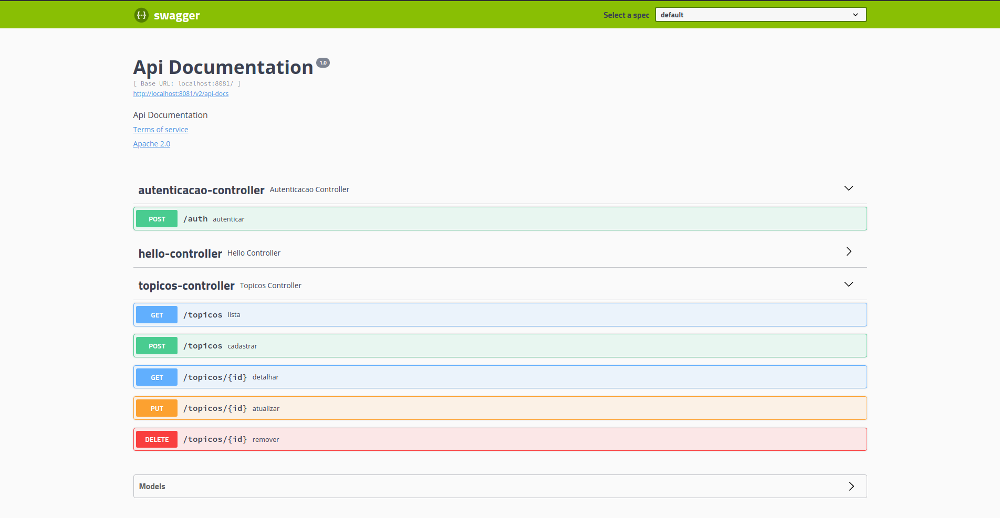
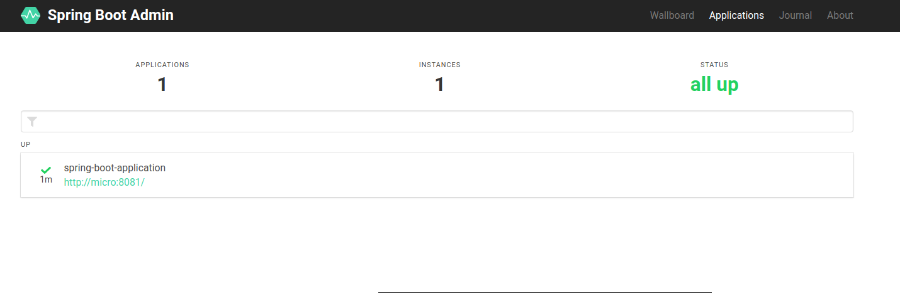

# forum
=======

Desenvolvimento de uma API Rest com Spring Boot e Spring Framework

Spring Boot 2.2.7

Caelum: Curso FJ-27 & Alura

Documentação da API via Swagger

Monitoração com Spring Boot Actuator

